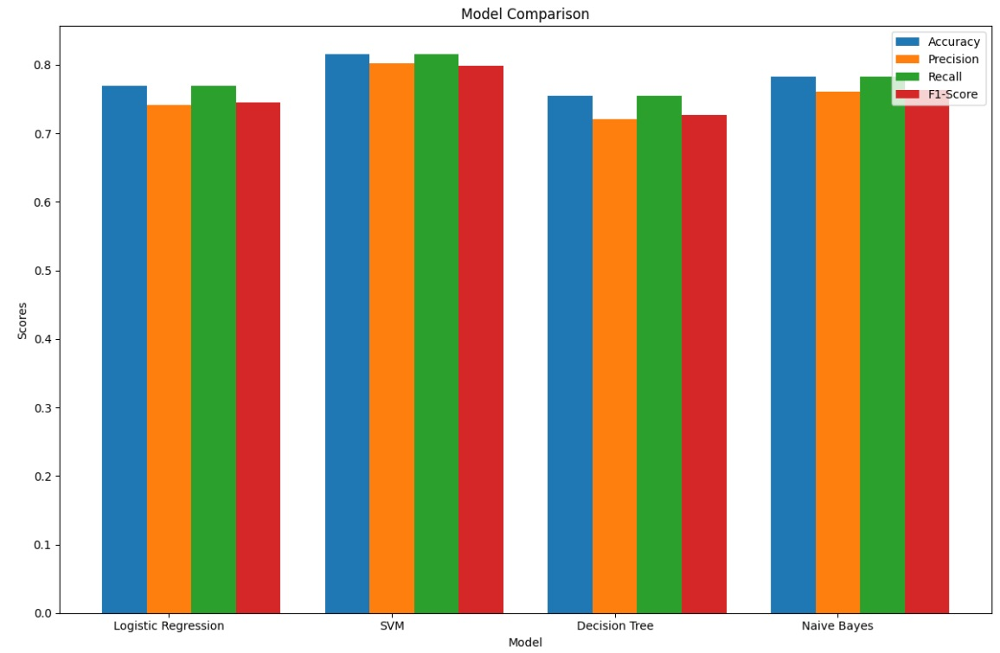

## Use Text Classification to Indentify case category

**Himanshu Yadav**

### Executive summary

**Project overview and goals:** 
The goal of this project is to build a robust machine learning model to automate the categorization of support cases. This model will analyze the text fields, specifically the "Short Description" and "Description," of a case and assign it to the correct category for routing to the appropriate support queue. The categorization hierarchy consists of two levels:

- **Level 1 (Parent Categories):** "Incident" and "Service Request."
- **Level 2 (Child Categories):** Subcategories under each parent category:
    - **Incident:** "Platform Issue" and "Integration Issue."
    - **Service Request:** "User Help" and "User Access."
      
The model employs a two-step binary classification approach:

1) **Parent Category Classification:** Determines whether a case belongs to "Incident" or "Service Request."
2) **Child Category Classification:** Assigns one of the four child categories based on the parent category.
   
To achieve this, we evaluate and tune four text classification algorithms: **Logistic Regression, Support Vector Machine (SVM), Decision Tree,** and **Naive Bayes.** Key performance metrics include **Accuracy, Precision, Recall,** and **F1-Score,**.

**Usage** 
This project addresses a real-world problem faced by support teams. I lead four support teams managing distinct areas of expertise, and this model will be integrated into a chatbot that assists users in raising tickets by directing their queries to the appropriate support queue. The chatbot will:

 - Parse user inputs about issues or questions.
 - Automatically categorize and assign cases to the correct team, reducing delays in issue resolution.
   
Future iterations of the project aim to enhance the system by identifying similar past tickets and sharing their resolutions with support engineers, enabling quicker problem resolution.

**Data and Testing**
The project leverages two years of historical support case data, with "Short Description" and "Description" fields serving as the primary input features. Each case is tagged with corresponding Parent Tags and Child New Tags columns, which serve as ground truth labels for training and validation. The model's performance will also be tested on unseen data from the last two months, ensuring its effectiveness in real-world scenarios.

**Results**
Out of the four Logistic regression performed the best. SVM Performed the best in Parent classification followed by Logistic regression , but Logistic regression was better in Child classification. Logistic regression performance was wayt better for Unseen data. Therefore I decided to use the Logistic regression model. 

